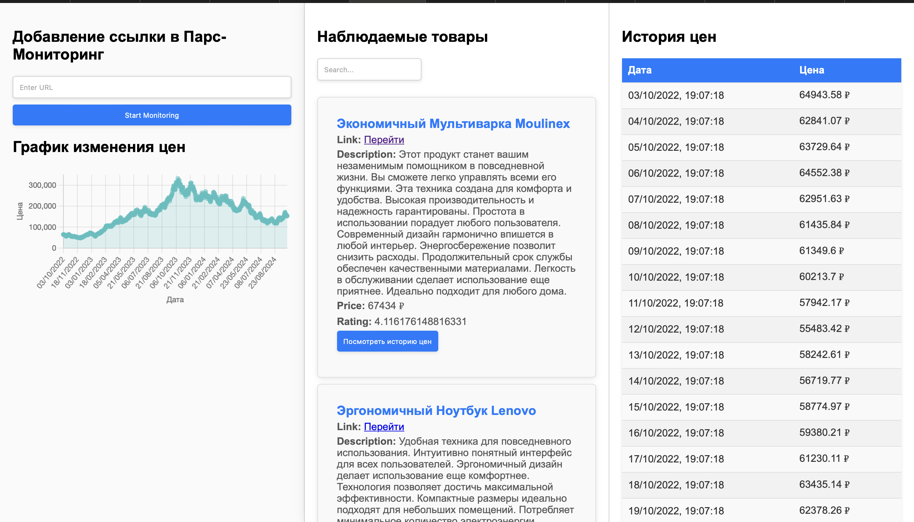
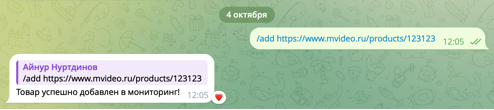
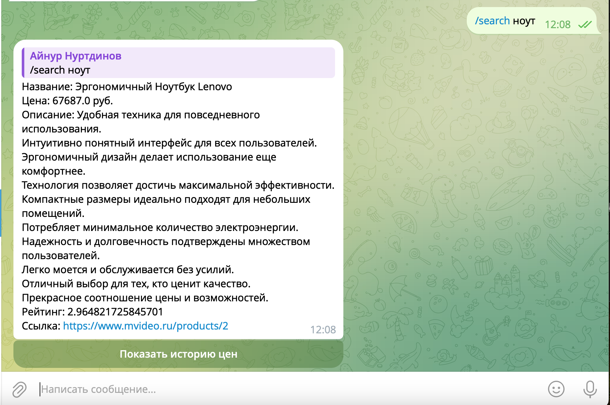
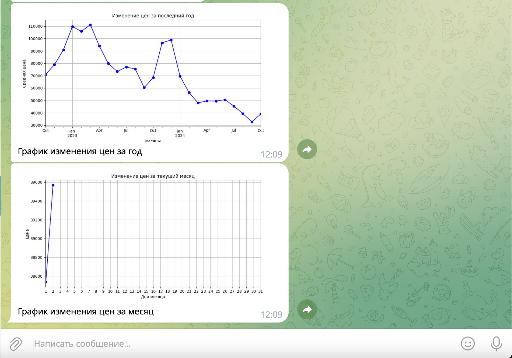

# Monitoring Price Project

## Описание
Проект для мониторинга цен на различные товары. Включает API, сервисы, задачи Celery и поддержку Redis для хранения данных и очередей задач.

## Технологии
- **FastAPI** - Веб-фреймворк для создания REST API
- **Celery** - Асинхронные задачи и обработка очередей
- **Redis** - Брокер сообщений и хранилище данных
- **PostgreSQL** - Основная база данных
- **Docker & Docker Compose** - Оркестрация контейнеров

## Установка и запуск

### 1. Предварительные требования
- **Docker** и **Docker Compose** должны быть установлены на вашем компьютере.

### 2. Клонирование репозитория
Сначала клонируйте репозиторий:
```bash
git clone https://github.com/Runya1337/test_ooo_centre_security
cd test_ooo_centre_security/Monitoring_Price
```

### 3. Сборка и запуск контейнеров
Используйте Docker Compose для сборки и запуска контейнеров:

```bash
docker-compose up --build
```
Примечание: Добавьте флаг --scale celery_worker=3 чтоб
распределить нагрузку между несколькими воркерами
```bash
docker compose up --scale celery_worker=3 --build
```

### 4. Заполнение тестовыми данными базу данных
В папке api/src/utils есть файл fill_db.py, который необходимо
запустить для наглядности данных 

### 5. Демонстрация работы 

Чтоб увидеть подобную картинку переходим по адресу
http://127.0.0.1:8080



Пример добавления ссылки в мониторинг в Телеграм боте 



Пример поиска по названию в Телеграмм боте



Отработка кнопки просмотра истории цен 



